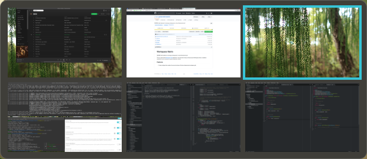

# Workspace Matrix

GNOME shell extension to arrange workspaces in a two dimensional grid with workspace thumbnails.

   

This is a clone of the [Workspace Grid](https://github.com/zakkak/workspace-grid) extension. I was not able to wrap my head around Workspace Grid so I started to implement my own extension to get the features I wanted.

## Features

- Allows free configuration of the number of rows and columns of the workspace grid.
- Shows workspace thumbnails with live previews of the workspaces.
- Allows free configuration of the scale of the workspace thumbnails.
- Allows free configuration of the timeout of the workspace switcher popup.
